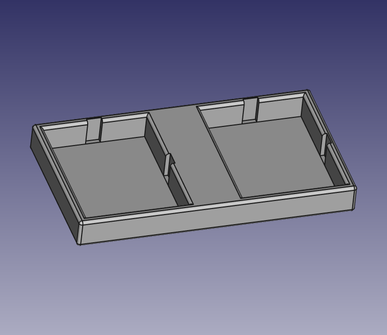

# Mini breadboard holder

A mini breadboard holder.



Some cheap `ESP32` development boards are fat. They use 9 columns on a
breadboard, leaving just a single column for use. A workaround is to solder
long female strip connectors. Unfortunately, some boards have pin headers
soldered. It is a bit hassle to remove them and solder connectors. With this
holder, you can install two mini breadboards and insert a development board
between them.

Supported mini breadboards:

* 45.5 mm x 34.5 mm, without joints
* 46 mm x 36 mm, with joints (4 mm x 1.2 mm)

## Requirements

- FreeCAD
- BSD make (optional, not GNU make)

## Usage

To export the object to STL file:

```console
PYTHONPATH=/usr/local/FreeCAD/lib python3 export-stl.FCMacro
```

where `PYTHONPATH` should be path to FreeCAD python library directory.

Or use [`Makefile`](Makefile):

```console
make
```
## Tips

PLA works fine.

Infill 20%. It rarely matters.

0.2 mm layer height is recommended.

## Authors

- [Tomoyuki Sakurai](https://github.com/trombik)

## License

ISC. See [LICENSE](LICENSE).
